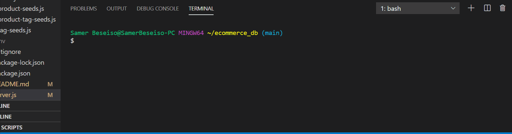

# e commerce Information

### Table of Contents:

- [Description](##-Description)
- [Installation](##-Installation)
- [Usage](##-Usage)
- [Credits](##-Credits)
- [License](##-License)

## Description

In this page you will be able to see the product tags and category using insomnia.

## Demo

## Installation

You will need to install dependencies with **npm i or npm install**

## Usage

## Credits

- node
- express
- nodemon
